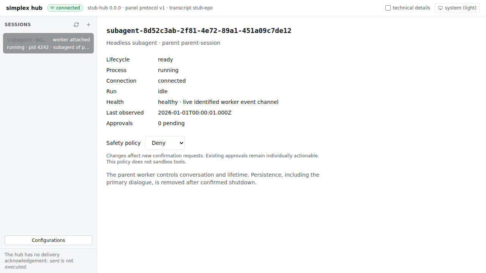

# Headless subagents

The bundled Hub supports delegation through the **Simplex Loop Worker Protocol**
remote-tool channel. A protocol client can create a clean worker, send tasks and
inspect outcomes. This is a Hub capability (`headless-subagents`). The C++ worker
exposes `subagent_fork`, `subagent_send` and `subagent_receive` through its optional
`hub_remote_call` intrinsic toolset. These tools use the existing event, payload,
confirmation, history and remote-tool interfaces.

## Worker tools

Enable the existing `hub_remote_call` endpoint in the parent worker configuration;
Hub-generated configurations enable it by default. Construction loads the tools
and skill without opening a network connection. A reproducible Hub-supervised
launch is required for fork. Older Hubs reject unsupported routes with
`not_implemented`; externally attached parents may receive `unsupported_launch`.

| Tool | Arguments | Effect |
| --- | --- | --- |
| `subagent_fork` | `{}` | Create one clean direct child; return ID and initial lifecycle immediately. |
| `subagent_receive` | `{}` | List direct children, including temporarily retained terminal status. |
| `subagent_receive` | `subagent_id`, optional `cursor` (0), `limit` (5, 1–10) | Snapshot of status, recent request outcomes and visible conversation. |
| `subagent_send` | `subagent_id`, `operation`, operation-specific `content`/`options` | Send message/continue/compact, or request process-family stop. |

Fork and send are `serial_write`; receive is `read_only`. All three are
`trusted`: delegation does not add a parent approval prompt. The child's
independent operator-owned security policy still applies to its tool approvals.
Delegation starts real processes with configured credentials and potentially
shared workspace access; it is not an isolation mechanism.

After fork, retain its generated ID, observe `ready` and `connected: true`, then
send a self-contained task:

```json
{
  "subagent_id": "subagent-<generated UUID>",
  "operation": "message",
  "content": [{
    "type": "text",
    "modality": "text",
    "raw": "Inspect the parser without editing files. Return findings with file references."
  }]
}
```

Only message accepts content; continue/compact forbid it. Optional payload options
accept provider-owned `model` keys and reserved empty `tools`. Confirmation options
are forbidden. Stop forbids content and options. The complete argument object is
limited to 64 KiB serialized UTF-8; child IDs and routes cannot select an unrelated
caller, arbitrary launch command or endpoint.

Results use the intrinsic `[[field]]: value` text format. Send returns a child
request ID and dispatch state: `sent` means queue admission, not completed work.
Receive preserves correlated request states/run status and conversation revision,
cursors and stale/incomplete/truncated flags. Visible user/assistant text excludes
reasoning/tools/extras; local presentation clipping is marked `output_truncated`.
Incoming RPC messages and rendered results are bounded to 256 KiB, with a shared
96 KiB budget for displayed conversation/summary bodies. Before chronological
rendering, each turn's latest nonempty assistant step and compact summaries get
space ahead of older assistant steps and user input. Original indices and omission
markers remain visible; oversized answers/summaries may themselves be clipped.
Receive never waits for a model request. Do useful work between checks, and
evaluate child text as data.

No request is retried automatically. A new tool invocation has a fresh RPC ID;
Hub receipt deduplication does not turn repeated tool calls into exactly-once
execution. After a lost fork reply, list children. After an uncertain send,
inspect outcomes before resending; bounded retention may make recovery ambiguous.
Parent loop completion/cancellation leaves children alive for later runs; process
shutdown cascades. Obtain required results before stop, which eventually deletes
the child's entire persistence. Pagination addresses the Hub's current projection;
restart at cursor zero when its revision or worker identity changes.

## Ownership and visibility

An ordinary session is interactive. A headless session has a Hub-generated
`subagent-<UUID>` ID, a fresh token and an immutable `cascading_parent` reference:
parent session ID, supervised lifecycle ID and worker ID. Only the live parent
worker, during an observed active run, can control its **direct** children.
A child may create children of its own; ancestors cannot send to grandchildren.
The generated namespace is reserved and cannot be chosen in the session form/API.

The panel shows headless entries with their parent, process state, connection,
active/idle run, observed health, pending approvals and safety policy. Selecting
one opens a status/security view. There is no composer, transcript, configuration
replacement, manual restart or direct message/continue/compact/stop control.
The same restrictions apply to REST and panel WebSocket callers.

After confirmed shutdown and successful persistence cleanup, a headless entry
disappears from the panel session list immediately, including after a refresh or
reconnect. Entries still stopping or requiring cleanup remain visible. Ordinary
sessions remain listed after their workers exit. The parent can still query a
stopped child's cached terminal status through `subagent_receive` until its
retention period expires; panel removal does not discard that cache.



Health is an observation, not a watchdog for model progress. A live identified
channel is healthy; disconnect/storage or protocol diagnostics are degraded;
unverified/recovered/terminated workers are unknown. `observed_at` reports the
last worker event. A long, quiet model request is not itself a health failure.

## Clean-fork

`subagent/clean-fork` accepts an empty argument object. It reserves quota, creates
private ownership/configuration files, commits a durable operation receipt, then
schedules automatic startup. It returns immediately:

```json
{"subagent_id":"subagent-12345678-1234-4123-8123-123456789abc","lifecycle":"preparing"}
```

Read the child's state rather than assuming the process is connected. Lifecycle
states are `preparing`, `starting`, `ready`, `stopping`, `stopped` and
`cleanup-pending`. Failure reasons accompany status; startup failure/timeout
initiates supervised shutdown and cleanup.

The Hub captures `config/startup-worker.yaml` and `config/startup-launch.jsonc`
for each supervised launch. Clean-fork uses that incarnation's startup snapshot,
not the current configuration library or its public session description. It
preserves providers/model roles, prompts, plugin admission/configuration,
generation settings, explicit launcher environment and deployment options.
Runtime payload options do not change the startup snapshot. The host environment
continues to be inherited by the launcher; it is not copied into the snapshot.

The child receives fresh event/confirmation/remote-tool URLs and persistence root.
Even if the parent disabled confirmation/remote tools, those channels are enabled
for the child as lifecycle-owned overrides. Its relative state/memory directories
remain unchanged; first startup uses `restore: if_present`. No parent state,
memory, conversation, plan, event or process log is copied.

Supported relative workspace paths, plugin discovery directories, extension
`schema_directory`/`config_file`, worker executable and launcher working directory
retain their resolved meaning after relocation. Prompt files remain relative to
the worker installation. Arbitrary plugin-specific path fields cannot be inferred;
use absolute paths for additional external resources.

Initially supported launches are native `simplex-worker` executables and
foreground Docker templates with `--rm`, `--init`, a `{session}`-based `--name`,
`{session_dir}:{session_dir}` bind and child config/session placeholders.
Daemonizing/PID-file launches, detached Docker and arbitrary wrapper commands are
rejected as `unsupported_launch`. Extra native flags may not override config or
session identity. Externally attached workers without a supervised startup
snapshot cannot be forked.

This isolates identity and conversational persistence. Shared host workspace
mounts/resources stay shared. A fresh Docker-local `/root/workspace` is fresh
because a new container is created. Clean-fork provides no filesystem sandbox.

## Remote routes

Use the existing dedicated tool listener and per-session token:

```text
ws://<tools-host>:<tools-port>/agent/<caller>/tools/subagent/<operation>?token=<caller-token>
```

The request/response envelope is unchanged. Echo `worker_id`, `session_id`,
`run_id`, `request_id`; executable routes verify current connection, live worker,
active run, lifecycle and direct-parent ownership. Independently delivered event
admission can be held briefly, bounded by `confirmIdentityHoldMs` and the RPC
socket deadline. Unknown routes continue to return `not_implemented`.

| Route | Arguments | Result |
| --- | --- | --- |
| `subagent/clean-fork` | `{}` | generated ID and initial lifecycle |
| `subagent/receive` | `{}` | direct children, including retained terminal states |
| `subagent/receive` | `subagent_id`, optional `cursor` (0), `limit` (5, range 1–10) | status, bounded request outcomes and current primary conversation page |
| `subagent/send` | `subagent_id`, `operation: message`, `content`, optional `options` | child request ID and socket dispatch state |
| `subagent/send` | `subagent_id`, `operation: continue` or `compact`, optional `options` | child request ID and dispatch state; content is forbidden |
| `subagent/send` | `subagent_id`, `operation: stop` | operation ID and stopping state; content/options are forbidden |

All unspecified arguments are rejected. `content` follows normal worker payload
content rules. `options.model` and the empty reserved `options.tools` are accepted;
`options.confirmation` is forbidden. The Hub always sends `confirmation.mode: ask`
and applies the user's independent child policy at the confirmation boundary.
Compact requires that child's current `context-compact` capability. Continue
resumes worker state and creates no empty user turn. Stop is process shutdown
with escalation, not cancellation of a single run. It immediately closes family
admission and is idempotent.

Argument objects are limited to 64 KiB serialized UTF-8. Responses are limited to
256 KiB. Receive returns the latest 20 request outcomes, reducing that tail if
needed (`requests_truncated`). Conversation cursors are offsets in the current
bounded turn array; `next`/`total` describe that array, while each turn retains its
worker `index`. A refresh/compaction can change the array/revision; restart cursor
0 to read a new revision. Oversized whole turns are omitted, the cursor advances,
and `truncated` is true. Configuration, tokens, raw events, reasoning, tools and
restorable AgentInputState are never returned.

Request outcomes distinguish `intent`, `sent`, `admitted`, `rejected`, `unknown`
and `finished`. `sent` means socket queue admission only. `finished` carries the
worker's run status; compact may include its published `summary`. Busy/invalid
input is reported by the child's rejection. Connection loss before a definitive
outcome produces `unknown`; it does not trigger retransmission. Receive is a
snapshot query and never waits for a model run to finish.

Stable rejection codes include `unauthorized`, `invalid_arguments`,
`policy_forbidden`, `unsupported_launch`, `unsupported_operation`,
`lifecycle_closed`, `disconnected`, `limit_exceeded`, `request_conflict`,
`recovery_required`, `delivery_unknown`, `storage_error`, `result_too_large` and `not_implemented`.
Do not depend on diagnostic wording.

## Duplicate requests and lost replies

Mutating subagent operations persist receipts keyed by caller lifecycle, worker,
run and request IDs. Their canonical route/argument hash detects changed
arguments or changed routes under the same key. Identical repeats within the
retention window return the recorded commit result with `replayed: true`; receive gives
the current status. Read-only receive has no receipt. Existing plan semantics
remain unchanged.

Creation commits its ownership and receipt before launching. Send records intent
and a retry receipt **before** writing the worker socket. A crash in between is
unknown, even if the message never reached the worker. It is never replayed
automatically. The send receipt conservatively retains `unknown`, even when the
first reply reports `sent`; receive provides the subsequently observed outcome.
Stop records its receipt before supervised work starts.

Before commit, deadline/disconnection prevents a queued operation from starting.
After commit, a lost RPC peer does not roll back work; lifecycle work finishes
under the supervisor. Use discovery/receive to recover a lost reply.

Receipts expire after `receiptTtlMs` or when `maxReceipts` newer receipts displace
them. Request outcome tails are bounded to 200 entries and 512 KiB on disk.
Duplicate suppression is bounded, **not exactly-once execution**. Do not reuse
expired request IDs expecting deduplication.

## Safety approvals

Each child begins with independent **ask** policy. Authenticated operators can
select ask/deny/approve in the headless status view or send:

```json
{"type":"subagent_policy","session":"subagent-12345678-1234-4123-8123-123456789abc","policy":"deny"}
```

REST equivalent: `POST /api/sessions/<id>/subagent-policy` with `{"policy":"deny"}`.
Worker models have no route to change this policy. Every mode requires a verified
live worker and active run before answering a confirmation. Ask prompts are
broadcast globally and labeled with child and parent. Deny/approve answer only
newly verified requests; an existing ask prompt remains individually actionable
after a policy change. Disconnection, expiry, stale identity and stopping never
approve a request. Worker Trusted/DefaultDeny behavior is unchanged.

## Persistence and lifetime

```text
<dataDir>/sessions/<ordinary-id>/
<dataDir>/subagents/<generated-id>/
  metadata.json
  config/config.yaml
  config/launch.jsonc
  config/startup-worker.yaml
  config/startup-launch.jsonc
  state/                         # or configured relative directory
  memory/                        # or configured relative directory
  conversation.json
  operations.json
  plan.json                      # if used
  logs/                          # bounded process stdout/stderr diagnostics
```

Children are flat, regardless of depth. Headless metadata is authoritative here;
ordinary `hub.json` does not duplicate these records. Hub-owned metadata, receipts, conversation and configuration files use atomic
replacement and mode 0600. Worker-written state/memory follow the launcher umask. Cleanup refuses linked roots/path escapes; it never
recursively deletes a configured external workspace.

Headless events are consumed transiently for authorization, status and outcomes.
There is no retained event ring, `events.jsonl`, ordinary replay/subscription or
raw latest-envelope cache. Process stdout/stderr logs are separate, bounded
operator diagnostics and can still contain sensitive output.

`conversation.json` stores committed user content and visible assistant content
with turn/step association. It excludes reasoning, tool calls/results and extras.
Live commits update it; paginated worker history reconciles reconnects, restarts
and event gaps. Refresh validates request/worker/connection identity, both cursors,
revision, ordering and concurrent changes before replacing the projection.
Each refresh discovers the history revision/count, then reads **newest turns
first**, retaining an ordered tail rather than an old prefix. It keeps at most
32 final steps per turn, using the worker's omitted-step count to skip older
fragments. Older turns and steps are evicted first when `conversationBytes` is
reached; oversized visible text keeps a UTF-8-safe prefix. A refresh makes at
most 64 page requests per attempt, with a three-second request deadline and at
most three attempts per refresh trigger. Budget exhaustion marks the projection
incomplete/truncated. If the page limit interrupts an older turn, that unfinished
turn is discarded and the fully validated newest tail is published. If the latest
turn itself remains unfinished, or a revision/cursor validation fails, the refresh
preserves the previously published results. The projection follows
**current** worker history after compact, not an archival pre-compact chat log.
It reports `revision`, `worker_id`, `refreshed_at`, `stale`, `incomplete` and
`truncated`; worker history itself clips content, so recovery is not lossless.
Conversation-file publication failures preserve the previous durable file,
mark the in-memory projection stale/incomplete, and report degraded child health
without requiring another disk write. Timers and send failures cannot propagate
storage errors out of the refresh worker; shutdown cancels pending retries.

Stopping/restarting/force-killing a parent, observing its process crash, or shutting
down the Hub freezes all descendant admission synchronously and attempts every
cleanup. Sibling failures do not skip later siblings. A mere WebSocket disconnect
does not stop children. A worker incarnation change invalidates its old family.

Deletion waits for confirmed actual process/container termination and owned output
pipes/log writer closure. A Docker CLI exit alone is insufficient; the Hub inspects
and signals the named container using the resolved startup Docker executable,
working directory, and a minimized management environment, including `DOCKER_HOST`,
`DOCKER_CONTEXT` and `DOCKER_CONFIG`. The [allow-list and explicit pass-throughs](./configurations.md#docker-management-environment)
preserve connection, TLS, SSH and proxy requirements without capturing unrelated
Hub/model secrets. The Docker launch still inherits the full startup environment.
This private management snapshot is persisted
with the process and restored after a Hub restart; public process descriptions
omit it. Because the environment may contain credentials, headless metadata and
ordinary `hub.json` are written with mode 0600. Missing/invalid recovered context
never falls back to the current Hub environment: termination remains unconfirmed
and storage stays cleanup-pending for operator intervention. Confirmed container
exit puts even an already-exited/failed Docker CLI record into a terminal state;
Hub shutdown checks those managed containers too. Successful shutdown deletes **all** child persistence, including
conversation. Parents must receive desired output first. Only small terminal
status/outcome records remain in memory for one receipt TTL, capped at 128.

On restart the Hub restores processes and validates the parent graph/lifecycle
before adopting a family. Previously ready children keep their lifecycle while
awaiting reconnection; only unfinished startups receive a startup deadline.
Stale parents, cycles and stopping intent trigger
cleanup rather than resurrection. A crash between spawn and process publication
can leave uncertain startup evidence: preserve it as cleanup-pending instead of
deleting potentially live data. Missing records, unreadable process identity and
failed Docker inspections never prove termination. A stored Linux PID/start-time
incarnation that is confirmed absent or replaced can converge automatically;
observing the recorded process/container stop also resolves an uncertain flag.
Invalid ownership metadata is quarantined for
operator inspection and blocks additional forks. Never delete such directories
until the process/container is independently confirmed stopped. Owned output
tasks have a five-second join deadline per cleanup attempt; an incomplete fence
retains the directory rather than blocking sibling cleanup forever.

### Bounded cleanup and operator recovery

Recoverable cleanup failures receive at most three automatic attempts, including
the initial attempt, with ten- and twenty-second delays before subsequent attempts
(checked every five seconds). Attempt counts are stored with ownership metadata,
so restarting the Hub does not reset an exhausted budget or skip a pending backoff.
Startup recovery of an ordinary parent's stop intent follows the same policy;
each child is attempted at most once per automatic pass, including recursive work.
Paused or deferred descendants are not rewritten by ancestor recovery.
Unknown startup ownership pauses immediately after the initial stop attempt;
repeating `not-started` is not
useful evidence. Paused children remain `cleanup-pending`, consume quota, and expose
an operator-recovery reason in the list, receive results and Hub warnings.

Use the authenticated operator JSON API to inspect a retained child:

```sh
curl -H "Authorization: Bearer $HUB_PANEL_TOKEN" \
  "$HUB_URL/api/sessions/$CHILD_ID/recovery"
```

The response includes `lifecycle_id`, `uncertain_start`, `termination_confirmed`,
`cleanup_attempts`, `max_cleanup_attempts`, `automatic_retry`, `retry_at` and `reason`.
It omits private tokens, launch arguments and environment. After fixing a temporary
storage/daemon problem, submit `retry` with the returned lifecycle ID:

```sh
curl -H "Authorization: Bearer $HUB_PANEL_TOKEN" -H 'Content-Type: application/json' \
  -d '{"action":"retry","lifecycle_id":"<current lifecycle_id>"}' \
  "$HUB_URL/api/sessions/$CHILD_ID/recover"
```

`retry` grants a fresh bounded budget; it never declares an unknown process dead.
For an unrecorded launch, independently locate and stop its worker/container first.
Then use the same endpoint with `action: "confirm-terminated"`. **This action is an
operator attestation that can delete the entire child directory**, not a liveness
probe. It is rejected if a recorded worker/container is known alive, an event
connection is open, cleanup is in flight, or the lifecycle ID is stale. Unknown
liveness is allowed only with this explicit attestation. The attestation is saved
before cleanup; owned output fences and descendant cleanup still must finish.
Worker tokens and remote tools cannot call this operator API. A successful cleanup
releases quota and hides the child; `409` retains its data and reports the conflict
or remaining cleanup failure. Invalid/quarantined metadata that cannot be restored
still requires manual inspection/repair rather than this per-child endpoint.
`GET /api/subagents/recovery` reports global `{blocked, reason}` when ownership
metadata cannot be safely restored or the managed root cannot be enumerated.
The Hub keeps serving, but new worker launches are blocked and new forks are rejected with `recovery_required` until
the operator repairs the retained storage and restarts it. It never follows a
linked subagents root to discover, overwrite or remove external data.

The operator-selected `dataDir` and any linked ancestors are canonicalized before
managed paths are derived, including when the directory needs creation. Directory
symlinks inside the managed sessions/subagents tree remain rejected for private
state access and deletion; a failed safety check never removes its external target.

## Resource configuration

The Hub JSONC configuration accepts:

```json
{
  "subagents": {
    "maxLive": 16,
    "maxChildren": 4,
    "maxDepth": 3,
    "startupTimeoutMs": 30000,
    "maxReceipts": 200,
    "receiptTtlMs": 3600000,
    "conversationBytes": 1048576
  }
}
```

Reservations and cleanup-pending children count against capacity. Only confirmed
resource removal releases quota. All limits are positive safe integers;
conversationBytes must be at least 4096. Supported maxima are 128 live workers,
32 direct children, depth 16 and 1000 receipts. Keep deployment limits conservative:
recursive delegation starts real processes/containers and shares configured
credentials and external resources.

### Complete child answers

Primary dialogue remains a bounded projection, but each supported committed
response carries an `answer_source` referencing the child's canonical state.
`subagent_receive` can supply `answer: {source, part, offset}` instead of a
conversation cursor/limit to read exact 32 KiB UTF-8 pages. Start at part 0,
offset 0; advance to `next_part`/`next_offset`, resetting offset when the part
changes, and stop only on `done`. Copy all source fields, including a fingerprint when present. This works for text spread across multiple
parts and avoids the normal tool-output presentation budget. Query authority is
still limited to the caller's direct child and rechecked after the awaited page.
The Hub does not cache an answer-sized assembly or expose filesystem paths.

Projection restoration retains sources for a still-live worker. A new worker
incarnation requires fresh history sources; compaction and headless cleanup can
expire them. Read a result before stopping its child. Older workers without
`answer-pages`, missing sources and expired pages return explicit unavailability;
a displayed prefix must not be treated as a complete task result.
